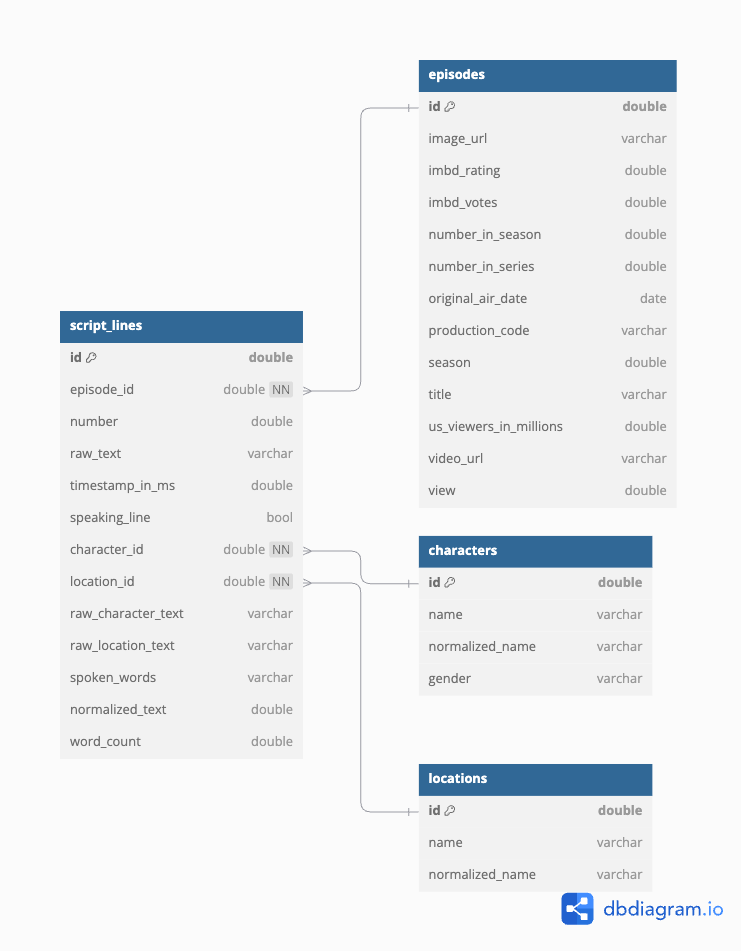

# The Simpsons Database

 *The Simpsons – Source: theverge.com*

## Description 

This repository holds the code used to create a database from 4 different datasets that contain the characters, locations, episode details, and script lines for approximately 600 episodes of The Simpsons. Additionally, it contains files used to query the database and create a data visualization to answer the question: **which characters have spoken the most total words, and what genders are represented among the top 12?**

## Repository Structure 

```
simpsons_database
|
├── data/
|     ├── characters_clean.csv    # cleaned characters table
|     ├── episodes_clean.csv    # cleaned episode table
|     ├── characters_locations.csv    # cleaned locations table
|     ├── script_lines_clean.csv    # cleaned characters table 
|     ├── simpsons_characters.csv   # raw character data
|     ├── simpsons_episodes.csv   # raw episodes data
|     ├── simpsons_locations.csv   # raw locations data
|     └── simpsons_script_lines.csv   # raw script lines data
|
├── build_simp_database/
|     ├── build_simpsons_database.sql   # script used to assemble database
|     └── simpsons.db   # database with 4 tables (characters, locations, episodes, script_lines) 
|
├── images/
|      └── simpsons_database.png   # database schema for README.md
|
├── readin_simp_data.R    # script used to read in and download the 4 simpsons datasets
|
├── simpsons-data-cleaning.qmd   # script used for data exploration and cleaning of tables
|
├── query_simpsonsdb.qmd  # script used for querying database to create data viz
|
├── environment_dependencies  #  R version, operating system, & packages used 
|
├── simpsons_database.Rproj   # R project 
|
├── README.md 
|
└── .gitignore     

```

## Database Schema 

Here is a diagram that outlines the structure and organization of the database. It contains 4 tables, `characters`, `episodes`, `locations` and `script_lines`. Schema created using [dbdiagram.io](https://dbdiagram.io/home).



## Data Access 

Originally, this dataset was scraped by Tod Schenider for his post [The Simpsons by the Data](https://toddwschneider.com/posts/the-simpsons-by-the-data/), for which he made the scraper available on [GitHub](https://github.com/toddwschneider/flim-springfield). Kaggle user William Cukierski used the scraper to upload the dataset, which has been rehosted [here](https://www.kaggle.com/datasets/prashant111/the-simpsons-dataset).

The code used to download the data into R was found on the [tidytuesday repository for 2025-02-04](https://github.com/rfordatascience/tidytuesday/tree/main/data/2025/2025-02-04) and is as follows: 

```
# Option 1: tidytuesdayR package 
## install.packages("tidytuesdayR")

tuesdata <- tidytuesdayR::tt_load('2025-02-04')
## OR
tuesdata <- tidytuesdayR::tt_load(2025, week = 5)

simpsons_characters <- tuesdata$simpsons_characters
simpsons_episodes <- tuesdata$simpsons_episodes
simpsons_locations <- tuesdata$simpsons_locations
simpsons_script_lines <- tuesdata$simpsons_script_lines

# Option 2: Read directly from GitHub

simpsons_characters <- readr::read_csv('https://raw.githubusercontent.com/rfordatascience/tidytuesday/main/data/2025/2025-02-04/simpsons_characters.csv')
simpsons_episodes <- readr::read_csv('https://raw.githubusercontent.com/rfordatascience/tidytuesday/main/data/2025/2025-02-04/simpsons_episodes.csv')
simpsons_locations <- readr::read_csv('https://raw.githubusercontent.com/rfordatascience/tidytuesday/main/data/2025/2025-02-04/simpsons_locations.csv')
simpsons_script_lines <- readr::read_csv('https://raw.githubusercontent.com/rfordatascience/tidytuesday/main/data/2025/2025-02-04/simpsons_script_lines.csv')

```
The code to read in this data is also located in the [readin_simp_data.R](https://github.com/jordancsibley/simpsons_database/blob/main/readin_simp_data.R) file. 

## Project Dependencies & Environment

To see information about the R version, operating system, and all packages used (with their versions) during the analysis of this project, see the [environment_dependencies](https://github.com/jordancsibley/simpsons_database/blob/main/environment_dependencies) file.

## Author 
Jordan Sibley 

Master of Environmental Data Science Student, Bren School of Environmental Science & Management

jcsibley@bren.ucsb.edu

jordan.c.sibley@gmail.com 

## Acknowledgments 

The material for this assignment was presented by TA Annie Adams in the course [Databases and Data Management (EDS 213)](https://ucsb-library-research-data-services.github.io/bren-eds213/) at the Bren School of Environmental Science & Management, Fall 2024. I'd also like to acknowledge the instructors of this course, Julien Brun and Greg Janée. 
